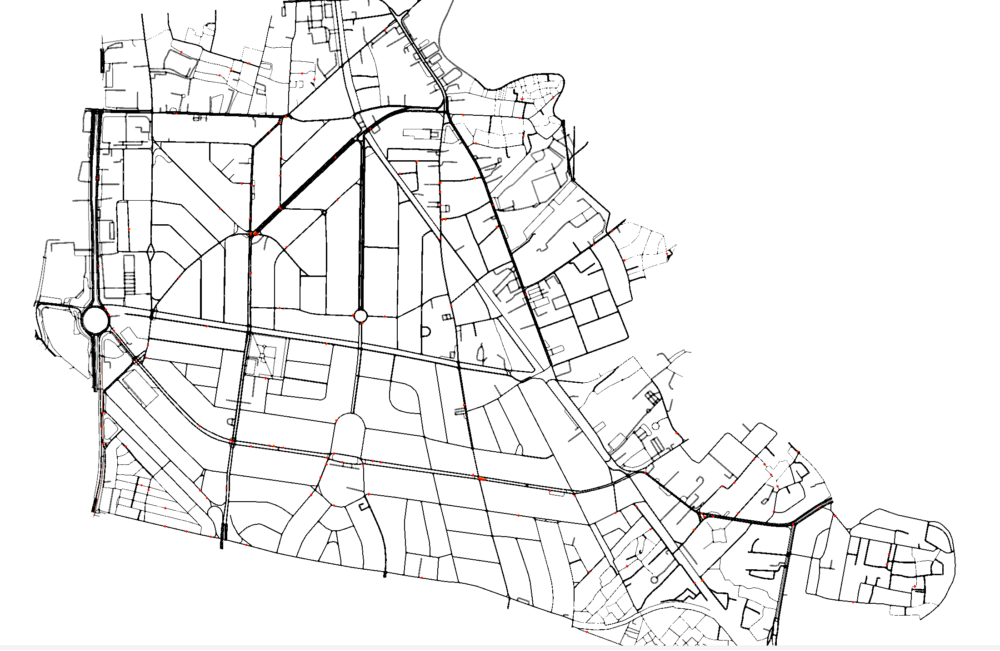

# CarbonMind: Simulasi Lalu Lintas Jakarta untuk Analisis Karbon

**CarbonMind** adalah sebuah proyek Proof-of-Concept (PoC) yang bertujuan untuk membangun model simulasi lalu lintas di area Jakarta Pusat menggunakan **SUMO (Simulation of Urban MObility)**. Proyek ini secara dinamis menghasilkan jaringan jalan dari data OpenStreetMap (OSM) dan membuat agen (kendaraan) sintetis dengan pola perjalanan harian untuk mensimulasikan skenario lalu lintas yang realistis.

Tujuan utamanya adalah untuk menciptakan fondasi yang dapat digunakan untuk analisis dampak lingkungan, seperti jejak karbon, dari mobilitas perkotaan.

## 📜 Daftar Isi

- [Fitur Utama](#-fitur-utama)
- [Demo Visualisasi](#-demo-visualisasi)
- [Teknologi yang Digunakan](#-teknologi-yang-digunakan)
- [Prasyarat](#-prasyarat)
- [Instalasi](#-instalasi)
- [Cara Menjalankan](#-cara-menjalankan)
- [Struktur Proyek](#-struktur-proyek)

## ✨ Fitur Utama

- **Pembuatan Jaringan Dinamis**: Mengunduh data jalan terbaru dari OpenStreetMap (OSM) untuk area Jakarta Pusat dan mengonversinya menjadi format jaringan SUMO (`.net.xml`) menggunakan `OSMnx` dan `netconvert`.
- **Generasi Agen Sintetis**: Membuat 200 agen (kendaraan pribadi) dengan sekuens perjalanan harian yang logis (misalnya, dari rumah ke kantor dan kembali), berdasarkan data Points of Interest (POI) nyata.
- **Pembuatan Rute Otomatis**: Menghasilkan file perjalanan (`.trips.xml`) dan rute (`.rou.xml`) yang kompatibel dengan SUMO menggunakan `duarouter`.
- **Siap untuk Simulasi**: Menghasilkan semua file yang diperlukan, termasuk file konfigurasi SUMO (`.sumocfg`), untuk langsung menjalankan simulasi.

## 🎥 Demo Visualisasi

Berikut adalah tautan ke video demo yang menunjukkan hasil visualisasi dari simulasi lalu lintas yang dihasilkan oleh proyek ini.

[](./demo/Visualization%20Demo.mp4)

**[Tonton Video Demo](./demo/Visualization%20Demo.mp4)**


*(Catatan: Anda mungkin perlu mengunduh repository untuk melihat video ini.)*

## 🛠️ Teknologi yang Digunakan

- **SUMO**: Platform simulasi lalu lintas open-source.
- **Python 3**: Bahasa pemrograman utama.
- **Jupyter Notebook**: Untuk alur kerja generasi data dan rute yang interaktif.
- **OSMnx**: Untuk mengunduh dan memodelkan data jaringan jalan dari OpenStreetMap.
- **Pandas & GeoPandas**: Untuk manipulasi dan analisis data tabular dan geospasial.
- **NetworkX**: Untuk analisis graf jaringan.

## 📋 Prasyarat

Sebelum memulai, pastikan sistem Anda telah terinstal:

1.  **Python 3.8+**
2.  **SUMO**: Pastikan direktori `sumo/bin` telah ditambahkan ke `PATH` environment variable sistem Anda. Ini diperlukan agar skrip Python dapat memanggil `netconvert` dan `duarouter`. Anda dapat mengunduhnya dari [halaman unduhan SUMO](https://sumo.dlr.de/docs/Downloads.php).

## 🚀 Instalasi

1.  **Clone repository ini:**
    ```bash
    git clone <URL_REPOSITORY_ANDA>
    cd <NAMA_DIREKTORI>
    ```

2.  **Buat dan aktifkan virtual environment (direkomendasikan):**
    ```bash
    python -m venv venv
    source venv/bin/activate  # Pada Windows, gunakan: venv\Scripts\activate
    ```

3.  **Install semua dependensi Python:**
    Buat file `requirements.txt` dengan konten berikut:
    ````
    // filepath: requirements.txt
    pandas
    osmnx
    networkx
    numpy
    geopandas
    tqdm
    jupyter
    ````
    Kemudian jalankan perintah instalasi:
    ```bash
    pip install -r requirements.txt
    ```

## ⚡ Cara Menjalankan

Proses utama untuk menghasilkan data dan rute simulasi dijalankan melalui Jupyter Notebook.

1.  **Jalankan Jupyter Notebook:**
    ```bash
    jupyter notebook
    ```

2.  **Buka dan Jalankan Notebook**:
    Dari antarmuka web Jupyter, buka file [`Generate routes.ipynb`](./Generate%20routes.ipynb). Jalankan semua sel dari atas ke bawah.

    Notebook ini akan melakukan langkah-langkah berikut secara otomatis:
    - **Langkah 1**: Mengunduh data OSM dan membuat file jaringan `network.net.xml`.
    - **Langkah 2 & 3**: Membuat data agen sintetis berdasarkan POI.
    - **Langkah 4**: Mengonversi data agen menjadi file `agent.trips.xml`.
    - **Langkah 5**: Menjalankan `duarouter` untuk menghasilkan file rute final `agent_routes.rou.xml`.

3.  **Jalankan Simulasi di SUMO**:
    Setelah notebook selesai dijalankan, Anda dapat membuka file [`jakarta_simulation.sumocfg`](./jakarta_simulation.sumocfg) menggunakan `sumo-gui` untuk melihat visualisasi simulasi.
    ```bash
    sumo-gui -c jakarta_simulation.sumocfg
    ```

## 📁 Struktur Proyek

```
.
├── Generate routes.ipynb       # Notebook utama untuk menghasilkan jaringan dan rute
├── jakarta_simulation.sumocfg  # File konfigurasi utama untuk simulasi SUMO
├── network.net.xml             # File jaringan jalan (dihasilkan oleh notebook)
├── agent_routes.rou.xml        # File rute agen (dihasilkan oleh notebook)
├── random.trips.xml            # Contoh file trips (opsional)
└── demo/
    └── Visualization Demo.mp4  # Video